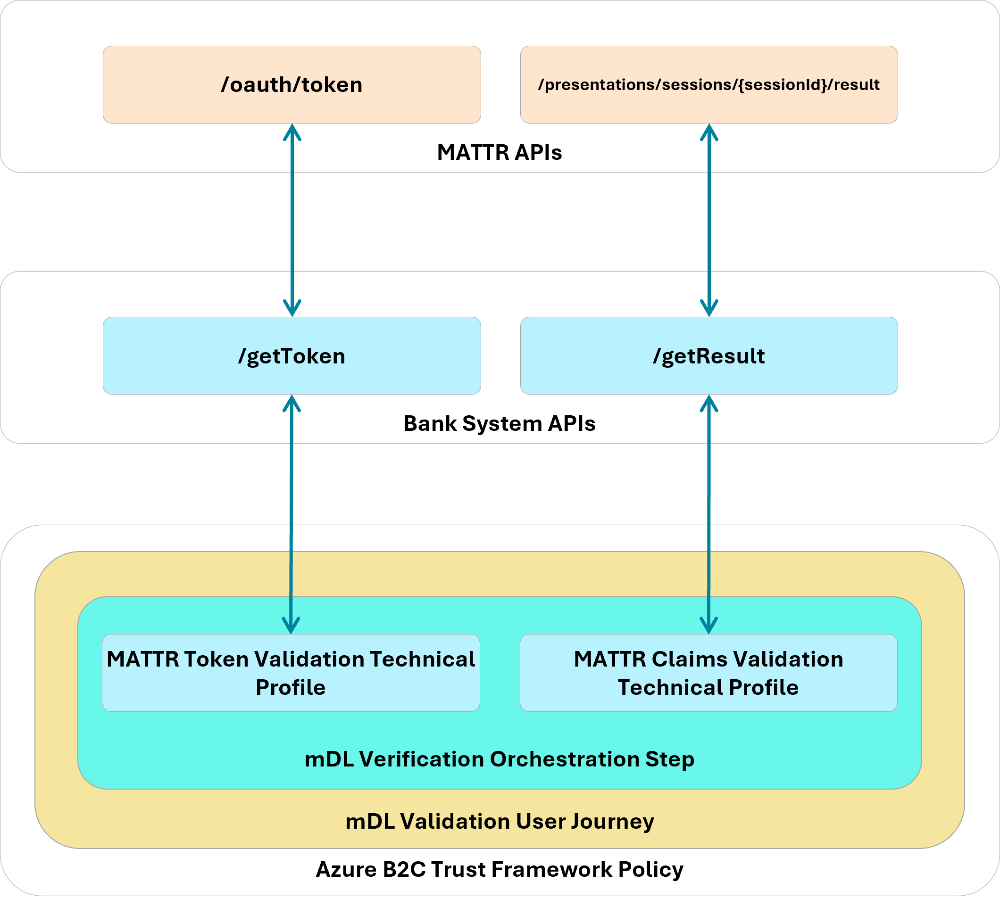

.. raw:: html

   

The NCCoE mDL Configuration Guide
=================================

.. admonition:: DISCLAIMER

  Certain commercial entities, equipment, products, or materials may be identified by name or company logo or other insignia in order to acknowledge their participation in this collaboration or to describe an experimental procedure or concept adequately. Such identification is not intended to imply special status or relationship with NIST or recommendation or endorsement by NIST or NCCoE; neither is it intended to imply that the entities, equipment, products, or materials are necessarily the best available for the purpose.

This page describes how we implemented this representative demonstration. Security architects, product managers, and other technical staff within your organization may find this information helpful. We cover the essential products employed in this reference design—the IDMS, Verifier, and Relying Party components. We do not re-create the product manufacturers’ documentation, which is presumed to be widely available. Rather, this webpage shows how we incorporated the products together in our environment. Videos of the final integrated system can be :doc:`viewed on this page <demonstration-videos>` .

Each section below represents a broad guideline in the integration process, which has been applied to the built :doc:`architecture <architecture/kyc-cip-onboarding>`. Within each section, we describe the steps we executed to satisfy each guideline. We include configuration file snippets, code examples, and links to technology contributor documentation where applicable.  

.. note::
  This is not a comprehensive tutorial. There are many possible service and security configurations for these products that are out of scope for this reference design. Further, credential issuance was out of scope for this demonstration. We recommend contacting state issuing authorities directly to determine the best path for test credential issuance.  

1. Establish a verifier environment
-----------------------------------

A verifier service is central to enabling both traditional and modern credential-based identity proofing. The verifier trusts the issuer’s signature and public keys and validates the
credential’s authenticity and integrity, without needing to contact the issuer directly. To support this, implementers should:

.. card:: 
  :class-card: welcome howtostep

  **Configure a dedicated verifier application** that defines how verification requests from the relying party (RP) are handled. This
  ensures that requests originating from different applications or lines of business can 
  be routed and processed according to policy.

| 
     
  Complete MATTR verifier application documentation can be viewed on the `MATTR documentation website`_. Note in 
  our implementation, we have set the ``resultAvailableInFrontChannel`` setting to ``false`` which allows our 
  bank function to retrieve presentation results in the back-channel. We have also enabled Digital Credential 
  API support as indicated by the ``dcApiConfiguration``. Complete DC API configuration documentation can be viewed at `this page`_. 

  .. _MATTR documentation website: https://learn.mattr.global/docs/verification/remote-web-verifiers/tutorial#create-a-verifier-application-configuration

  .. _this page: https://learn.mattr.global/docs/verification/remote-web-verifiers/dc-api/guide

  Click the dropdown below to view our full configuration.

  .. dropdown:: Demonstration Verifier Application Configuration
    :class-container: howtodrop

    .. code-block:: json

      {
        "id": "xxxxx-xxx-xxxx",
        "name": "Bank of NCCoE",
        "type": "web",
        "domain": "login.vcidentity.dev",
        "additionalDomains": [],
        "openid4vpConfiguration": {
          "display": {
            "bodyText": "Please scan the QR code to the right to provide information required for this interaction.",
            "logoImage": {
              "url": "https://www.nist.gov/sites/default/files/styles/960_x_960_limit/public/images/itl/nccoe_logo_cmyk_1.jpg",
              "altText": "NIST National Cybersecurity Center of Excellence Logo"
            },
            "headerText": "Please verify your mDL to continue",
            "primaryColorHex": "#000000"
          },
          "redirectUris": [
            "https://[IDP-DOMAIN]/[B2C-TENANT]/b2c_1a_fido_enroll_mobile/oauth2/v2.0/authorize"
          ],
          "supportedModes": "all"
        },
        "dcApiConfiguration": {
          "supportedBrowserPlatforms": {
            "mobile": true,
            "desktop": true
          }
        },
        "resultAvailableInFrontChannel": false
      }

.. card:: 
  :class-card: welcome howtostep

  **Define trusted wallet providers** including the URI schemes used to invoke wallet apps where appropriate. 

|

  .. note::

    This demonstration primarily uses the Digital Credential API to invoke wallet presentation, however, this step ensures a fallback path for the user when the DC API is unavailable or unsupported. 

  Full documentation to create a wallet configuration can be viewed on the `MATTR website`_. We have used the default ``mdoc-openid4vp`` custom URI scheme when 18013-7 Annex B fallback is required. Any wallet app registered to handle this scheme can respond to the verification request. `Additional guidance`_ regarding custom schemes can be found on the MATTR website. 

  .. _MATTR website: https://learn.mattr.global/docs/verification/remote-web-verifiers/tutorial#create-a-supported-wallet-configuration
  .. _Additional guidance: https://learn.mattr.global/docs/verification/remote-web-verifiers/guides/oid4vp-wallet-interactions

  .. dropdown:: Demonstration Wallet Configuration
    :class-container: howtodrop

    .. code-block:: json

      {
      "id": "xxxxx-xxx-xxxx",
      "name": "wallet",
      "openid4vpConfiguration": {
        "authorizationEndpoint": "mdoc-openid4vp://"
      }

.. card::  
  :class-card: welcome howtostep

  **Maintain a list of trusted credential issuers** including certificate authorities or signing keys used to validate mobile credentials (mdocs or similar). Issuer lists should be updated as test credentials evolve and should account for regional or national trust
  frameworks.

|

  Full documentation to `configure trusted credential issuers`_ can be viewed on the MATTR website. Click below to view our issuer configuration composed of test IACA certificates from MATTR and the states of Maryland and California. 

  .. dropdown:: Demonstration Issuer Configuration    
    :class-container: howtodrop

    .. code-block:: json

      {
        "data": [
          {
            "id": "a2a001e1-a7b8-4025-8a11-4c3c2badcc1b",
            "certificatePem": "-----BEGIN CERTIFICATE-----[certdata]-----END CERTIFICATE-----",
            "certificateData": {
              "notBefore": "2023-04-14T17:24:47.000Z",
              "notAfter": "2033-02-20T17:24:47.000Z",
              "country": "US",
              "commonName": "California DMV Root CA UAT",
              "stateOrProvinceName": "US-CA",
              "organisationName": "DMV"
            }
          },    
          {
            "id": "4298a03d-b348-40d7-b391-6e3534ae8f5b",
            "certificatePem": "-----BEGIN CERTIFICATE-----[certdata]-----END CERTIFICATE-----",
            "certificateData": {
              "notBefore": "2025-02-18T18:40:57.000Z",
              "notAfter": "2035-02-06T18:40:57.000Z",
              "country": "US",
              "commonName": "digitalcredentials.dev",
              "stateOrProvinceName": "California",
              "organisationName": "Digital Credentials"
            }
          },
          {
            "id": "c3cd3adb-2eb4-4917-b4f1-f4c155e20500",
            "certificatePem": "-----BEGIN CERTIFICATE-----[certdata]-----END CERTIFICATE-----",
            "certificateData": {
              "notBefore": "2025-04-08T06:00:00.000Z",
              "notAfter": "2030-04-08T06:00:00.000Z",
              "country": "US",
              "commonName": "MDOT MVA Root",
              "stateOrProvinceName": "US-MD",
              "organisationName": "Maryland MVA"
            }
          }
        ]

.. _configure trusted credential issuers: https://learn.mattr.global/docs/verification/remote-web-verifiers/tutorial#configure-a-trusted-issuer

2. Integrate verification capabilities into an identity management system
-------------------------------------------------------------------------

Your integration pattern will be dependent on your specific IDMS and verifier, however, below we have provided a diagram of the interactions between our IDMS (Azure B2C), bank system backend, and the verifier. Interactions between the IDMS and the Verifier are mediated by a set of APIs managed by the banking system as described in our practice guide. We chose to host these functions in the cloud using `Azure Function`_ service. The remainder of this section describes how we implemented this pattern.

.. note::

  Current users of Azure AD B2C can continue to use the B2C policies for orchestration, however, new Microsoft customers must use Entra External ID using `Native APIs`_.
  
  .. _Native APIs: https://learn.microsoft.com/en-us/entra/identity-platform/reference-native-authentication-api

.. _Azure Function: https://azure.microsoft.com/en-us/products/functions

To support credential-based verification from web applications:

.. card:: 
  :class-card: welcome howtostep
  
  **Integrate a web verification module** that supports back-channel retrieval of presented credentials.
  Back-channel retrieval may offer advantages in environments where server-side validation is preferred. 

|

  Implementers should first ensure that Javascript support `is enabled`_ in their Azure B2C tenant by following the B2C documentation. Javascript is disabled by default for security reasons. Next, embed the MATTR Web SDK into an HTML template that interacts with the user to initiate mDL verification. Our implmentation embeds a ``script`` tag to the `production SDK`_ within a template that is invoked during the account application, digital enrollment, and re-verification stages.

  .. code-block:: html

    <script src="https://cdn.mattr.global/js/verifier-sdk-web/2.1/verifier-js.production.js" data-preload="true"/>

.. _is enabled: https://learn.microsoft.com/en-us/azure/active-directory-b2c/javascript-and-page-layout?pivots=b2c-custom-policy#enable-javascript
.. _production SDK: https://learn.mattr.global/docs/verification/remote-web-verifiers/quickstart#script-tag-1

.. card::  
  :class-card: welcome howtostep
  
  **Initialize the verification module early in the application lifecycle** so relevant methods and configuration options are available to policy or orchestration engines.

|

  Refer to the MATTR documentation for complete instructions describing how to initiate the SDK in your application. In our Azure B2C html template which mediates verifcation, we defined a javascript function that is invoked when the user clicks the Verify My Identity button in the browser. 

  .. dropdown:: SDK Initialization
    :class-container: howtodrop

    .. code-block:: javascript

      function initializeVerifierSDK() {
        if (typeof MATTRVerifierSDK !== "undefined") {
          // SDK is loaded, initialize it
          MATTRVerifierSDK.initialize({
            apiBaseUrl: apiBaseUrl,
            applicationId: "98ff9c28-8231-421d-a833-0900dd3b4d34"
          });
          requestCredentials();
          console.log("MATTR Verifier SDK initialized");
        } else {
          // Retry after a short delay
          setTimeout(initializeVerifierSDK, 50);
        }
      }

.. card::  
  :class-card: welcome howtostep

  **Define credential queries** that clearly state required document types and attributes. Queries should support both primary mechanisms
  (e.g., DC API) and fallback mechanisms (e.g., protocol-based presentation profiles) to ensure cross-platform operability.

|

  Learn how to create a `credential query`_ on the MATTR documentation site. Our credential query is dependent on the applicant/customer journey stage. In the example below, we query for the attributes that satisfy Customer Information Program requirements and allow the bank to create a persistent identifier of the user from applicant to customer.
  
  .. dropdown:: Demonstration DCQL CIP Query
    :class-container: howtodrop

    .. code-block:: javascript

      "dcql": {
        credentials: [
          {
            id: "mdl",
            format: "mso_mdoc",
            meta: {
              doctype_value: "org.iso.18013.5.1.mDL"
            },
            claims: [
              { path: ["org.iso.18013.5.1", "given_name"] },
              { path: ["org.iso.18013.5.1", "family_name"] },
              { path: ["org.iso.18013.5.1", "birth_date"] },
              { path: ["org.iso.18013.5.1", "issue_date"] },
              { path: ["org.iso.18013.5.1", "expiry_date"] },
              { path: ["org.iso.18013.5.1", "issuing_country"] },
              { path: ["org.iso.18013.5.1", "issuing_authority"] },
              { path: ["org.iso.18013.5.1", "document_number"] },
              { path: ["org.iso.18013.5.1", "portrait"] },
              { path: ["org.iso.18013.5.1", "resident_address"] },
              { path: ["org.iso.18013.5.1", "resident_city"] },
              { path: ["org.iso.18013.5.1", "resident_state"] },
              { path: ["org.iso.18013.5.1", "resident_postal_code"] }
            ]
          }]
      }

  

  The query below enables the bank to create a persistent identifier of the customer with a minimal attribute set.

  .. dropdown:: Demonstration DCQL Minimal Query
    :class-container: howtodrop

    .. code-block:: javascript

      "dcql": {
        credentials: [
          {
            id: "mdl",
            format: "mso_mdoc",
            meta: {
              doctype_value: "org.iso.18013.5.1.mDL"
            },
            claims: [
              { path: ["org.iso.18013.5.1", "issuing_authority"] },
              { path: ["org.iso.18013.5.1", "document_number"] }
            ]
          }]
      }

  .. _credential query: https://learn.mattr.global/docs/verification/remote-web-verifiers/tutorial#create-credential-request

.. card::
  :class-card: welcome howtostep

  **Trigger presentation requests from within the RP workflow,** allowing users to present credentials in a same-device or cross-device
  flow. Implementers should evaluate which approach best aligns with
  their user experience and security goals.

|

  Refer to step 3 in the `Create credential request`_ section on the MATTR documentation website for general guidance when triggering a presentation request. In our implementation, we rendered an HTML button which triggers the request as shown below.

  .. code-block:: html

    <button id="mdlverifybutton" type="submit" onclick="verifyMDL()">Click to verify your mDL</button>

  .. _Create credential request: https://learn.mattr.global/docs/verification/remote-web-verifiers/tutorial#create-credential-request

.. card:: 
  :class-card: welcome howtostep
  
  **Select how verification results are returned** (front-end browser flow vs. backend integration). Each option carries different
  integration and data-handling implications that should be assessed based on system architecture and regulatory requirements.

|

  In our implementation, we made the architectural decision to retrieve validation results through our backend as a decision point to issue an access token to the client. Refer to MATTR's `detailed flow`_ that describes general guidance of the backend flow. First, our supporting javascript implements a callback that is invoked once the mDoc payload object has been collected and submitted to MATTR. MATTR returns a session identifier ``sessionId`` as shown in the code below.

  .. code-block:: javascript

        function processResponse(response, isDcApi) {
        console.info(
            '<<< MATTRVerifierSDK.requestCredentials crossDeviceCallback.onComplete',
            response
        );
        const sessionId = isDcApi ? response.value.sessionId : response.result.sessionId;
        document.querySelector("#sessionId").value = sessionId;
        document.getElementById("continue").click();
    }

  .. _detailed flow: https://learn.mattr.global/docs/verification/remote-web-verifiers/workflow#the-mattr-vii-verifier-tenant-returns-the-verification-results

  The B2C orchestration next retrieves an access token from our bank API then uses the ``sessionId`` to retrieve the presented attributes using Technical Profiles. Note that in the Account Application journey the attributes are not persisted to B2C, they are displayed to the applicant to confirm their information. 

  .. dropdown:: MATTR Journey Configuration
    :class-container: howtodrop

    .. code-block:: xml

      <TechnicalProfile Id="REST-getMattrTokenAnnexD">
            <DisplayName>GET mattr Token</DisplayName>
            <Protocol Name="Proprietary" Handler="Web.TPEngine.Providers.RestfulProvider, Web.TPEngine, Version=1.0.0.0, Culture=neutral, PublicKeyToken=null" />
            <Metadata>
              <Item Key="ServiceUrl">https://mattr-api.azure-api.net/mattrAPIs-python/token</Item>
              <Item Key="AuthenticationType">Basic</Item>
              <Item Key="SendClaimsIn">Body</Item>
              <Item Key="IncludeClaimResolvingInClaimsHandling">true</Item>
            </Metadata>
            <CryptographicKeys>
              <Key Id="BasicAuthenticationUsername" StorageReferenceId="B2C_1A_APIUsername" />
              <Key Id="BasicAuthenticationPassword" StorageReferenceId="B2C_1A_APIPassword" />
            </CryptographicKeys>
            <InputClaims>
              <InputClaim ClaimTypeReferenceId="mattr_grant_type" PartnerClaimType="grant_type" DefaultValue="client_credentials" />
              <InputClaim ClaimTypeReferenceId="correlationId" DefaultValue="{Context:CorrelationId}" AlwaysUseDefaultValue="true" />
              <InputClaim ClaimTypeReferenceId="dcApiProtocol" PartnerClaimType="type" DefaultValue="uri" />
              <InputClaim ClaimTypeReferenceId="mDL-Dataset" PartnerClaimType="dataset" DefaultValue="crossdevice" />
            </InputClaims>
            <OutputClaims>
              <OutputClaim ClaimTypeReferenceId="access_token" />
            </OutputClaims>
            <UseTechnicalProfileForSessionManagement ReferenceId="SM-Noop" />
          </TechnicalProfile>

    .. code-block:: xml

      <TechnicalProfile Id="REST-VerifyMdlSessionAnnexD">
            <DisplayName>Verify mattr session</DisplayName>
            <Protocol Name="Proprietary" Handler="Web.TPEngine.Providers.RestfulProvider, Web.TPEngine, Version=1.0.0.0, Culture=neutral, PublicKeyToken=null" />
            <Metadata>
              <Item Key="ServiceUrl">https://mattr-api.azure-api.net/mattrAPIs-python/result</Item>
              <Item Key="AuthenticationType">Basic</Item>
              <Item Key="SendClaimsIn">Body</Item>
              <Item Key="IncludeClaimResolvingInClaimsHandling">true</Item>
              <Item Key="ResolveJsonPathsInJsonTokens">true</Item>
            </Metadata>
            <CryptographicKeys>
              <Key Id="BasicAuthenticationUsername" StorageReferenceId="B2C_1A_APIUsername" />
              <Key Id="BasicAuthenticationPassword" StorageReferenceId="B2C_1A_APIPassword" />
            </CryptographicKeys>
            <InputClaims>
              <InputClaim ClaimTypeReferenceId="access_token" PartnerClaimType="token" />
              <InputClaim ClaimTypeReferenceId="sessionId" />
              <InputClaim ClaimTypeReferenceId="correlationId" DefaultValue="{Context:CorrelationId}" AlwaysUseDefaultValue="true" />
              <InputClaim ClaimTypeReferenceId="dcApiProtocol" PartnerClaimType="type" />
              <InputClaim ClaimTypeReferenceId="mDL-Dataset" PartnerClaimType="dataset" DefaultValue="crossdevice" />
            </InputClaims>
            <OutputClaims>
              <OutputClaim ClaimTypeReferenceId="mattr_challenge" PartnerClaimType="challenge" />
              <OutputClaim ClaimTypeReferenceId="family_name" PartnerClaimType="family_name.value" />
              <OutputClaim ClaimTypeReferenceId="given_name" PartnerClaimType="given_name.value" />
              <OutputClaim ClaimTypeReferenceId="birth_date" PartnerClaimType="birth_date.value" />
              <OutputClaim ClaimTypeReferenceId="issue_date" PartnerClaimType="issue_date.value" />
              <OutputClaim ClaimTypeReferenceId="expiry_date" PartnerClaimType="expiry_date.value" />
              <OutputClaim ClaimTypeReferenceId="issuing_country" PartnerClaimType="issuing_country.value" />
              <OutputClaim ClaimTypeReferenceId="issuing_authority" PartnerClaimType="issuing_authority.value" />
              <OutputClaim ClaimTypeReferenceId="document_number" PartnerClaimType="document_number.value" />            
              <OutputClaim ClaimTypeReferenceId="resident_address" PartnerClaimType="resident_address.value" />
              <OutputClaim ClaimTypeReferenceId="resident_city" PartnerClaimType="resident_city.value" />
              <OutputClaim ClaimTypeReferenceId="resident_state" PartnerClaimType="resident_state.value" />
              <OutputClaim ClaimTypeReferenceId="resident_postal_code" PartnerClaimType="resident_postal_code.value" />
              <OutputClaim ClaimTypeReferenceId="encrypted_cip_token" PartnerClaimType="encrypted_cip_token" />
            </OutputClaims>
            <UseTechnicalProfileForSessionManagement ReferenceId="SM-Noop" />
          </TechnicalProfile>

     

3. Design effective user journeys in an IDMS
--------------------------------------------

User journeys should be structured as clear orchestration sequences that
support identity verification, enrollment, and subsequent
authentication:

.. card:: 
  :class-card: welcome howtostep
  
  **Use explicit orchestration steps** to guide users through data collection, out-of-band verification, credential presentation, and final approval.

|

  We recommend implementers review the Azure AD B2C `orchestration documentation`_ to learn how to translate your business proceseses to web based user 
  journeys. Our configuration for the account application registration journey is reproduced below. The journey implements a comprehensive identity verification flow to support a bank account application process that combines traditional methods (email, phone, SSN) with modern mDL verification technology, ultimately creating a verified digital identity stored in Azure AD B2C.

  .. include:: examples/orchestration.rst

  .. include:: examples/registration.rst

  .. _orchestration documentation: https://learn.microsoft.com/en-us/azure/active-directory-b2c/userjourneys#orchestrationsteps

.. card:: 
  :class-card: welcome howtostep
  
  **Persist collected attributes as claims** at each step to ensure continuity across the journey and to support downstream validation
  steps.

|

  Persisting collected attributes allows them to be stored alongside user information in the `B2C directory`_. Attributes such as email, address,
  and the hashed mDL document number and issuing authority must be persisted in the directory for future use. For example, the unique mDL hash
  is used to ensure the correct mDL is presented in subsequent presentations when re-verifying the mDL for large currency transfers.

  In the previously defined registration flow, there is a step to collect the user's preferred address, preferred name, etc. These are stored
  alongside the user in B2C for use if, for example, their present mailing address does not match the address claim in the mDL. If the user
  fill these in, they should be used in lieu of the mDL attributes.

  .. _B2C directory: https://learn.microsoft.com/en-us/azure/active-directory-b2c/custom-policy-reference-sso

  .. include:: examples/ad-write-attributes.rst

.. card:: 
  :class-card: welcome howtostep
  
  **Support multiple verification methods** where appropriate, while still allowing organizations to enforce the preferred choice (e.g.,
  mDL verification) for the demonstration or production environment.

|

  Where possible, financial institutions should support multiple identity verification methods, such as mDL presentation, uploading photos
  of a physical drivers license, or manually entering the drivers license information. Note that for this demonstration, only mDL presentation
  is supported.

.. card:: 
  :class-card: welcome howtostep

  **Generate unique identifiers using non-reversible transformations** of verified credential attributes to support deterministic account lookup in later phases (e.g., digital enrollment or reverification).

|

  Generating and storing a non-reversible, unique, per-user identifier is required to be able to uniquely identify a user based on 
  specific attributes. In this implementation, B2C generates and stores a `hash`_ of the presented mDL's document number and issuing authority.
  When combined, these two attributes are guaranteed to be unique per mDL, and therefore unique per user. On subsequent interactions,
  such as mDL reverification and digital enrollment, this hash is used to both look up the user in B2C and to ensure the user has
  presented the same mDL that was presented during registration. If the presented mDL does not match a known or expected one, the flow
  does not continue.

.. _hash: https://learn.microsoft.com/en-us/azure/active-directory-b2c/general-transformations

4. Implement digital mDL credential verification
----------------------------------------------------------------

When integrating mobile driver’s license (mDL) or similar credential
verification:

.. card::  
  :class-card: welcome howtostep
  
  **Invoke verifier endpoints that return the necessary session or authorization data** before initiating wallet-based credential presentation.

|

  Prior to invoking a wallet, session and/or authorization data must be retrieved from the verifier. In the case of MATTR, prior
  to requesting session information, a dedicated verifier application must be created, as described in Step 1 of this document.
  The verifier application provides the required client ID and secret, and contains information specific to that application,
  such as the redirect URI or package signature (in the case of an Android application). Once the application is configured,
  requests can be made to the API. In this implementation, the MATTR JavaScript API does not require the client ID and secret
  to `create the presentation session`_, but the client ID and secret are required to retrieve the attributes via `back-channel`_.

  To illustrate this flow, the Python function below show how our demonstration retrieved presentation results using a bearer token.

  .. dropdown:: Python Azure Function
    :class-container: howtodrop

    .. code-block:: python

      def handle_result_request(request_data: dict, telemetry: dict) -> func.HttpResponse:    
      
      token = request_data.get("token")
      session_id = request_data.get("sessionId")

      if not token:
          return bad_request("Missing token")
      if not session_id:
          return bad_request("Missing sessionId")

      telemetry["sessionId"] = session_id

      result_url = f"{os.getenv('MATTR_TENANT_URL')}/v2/presentations/sessions/{session_id}/result"
      headers = {"Authorization": f"Bearer {token}"}

      result_response = session.get(result_url, headers=headers)
      logging.info(f"[Result] Response: {result_response.status_code}")

      fetch_event_logs(token, session_id)

      if not result_response.ok:
          return error_response("Failed to retrieve session result", result_response)

      try:
          return process_session_result(result_response.json(), telemetry)
      except Exception as ex:
          logging.exception("Failed to process session result")
          return server_error("Error processing session result", str(ex))

  Implementers should also be prepared to catch and gracefully handle error considerations that may occur in the validation process. The snippet below gives one such example of a validation error in which the user might have presented a credential whose issuer was not preconfigured in the verifier.

  .. code-block:: json

    
      "verificationResult": }
      "verified": "False",
      "reason": {
        "type": "MobileCredentialInvalid",
        "message": "X5Chain was not valid"
        }
      }
    

  Comprehensive guidance describing how verification results can be consumed by your application can be found on the MATTR website.       

  .. _create the presentation session: https://learn.mattr.global/docs/verification/remote-web-verifiers/tutorial#create-a-session-and-associate-a-challenge
  .. _back-channel: https://learn.mattr.global/docs/verification/remote-web-verifiers/tutorial#retrieve-verification-results
  .. _Comprehensive guidance: https://learn.mattr.global/docs/verification/remote-web-verifiers/guides/handling-verification-results

.. card:: 
  :class-card: welcome howtostep

  **Use platform APIs exposed by browsers for credential requests,** supporting both same-device and cross-device flows and ensuring alignment with emerging web standards.

|

  The `MATTR Verifier SDK`_ is a highly flexible and customizable SDK for mDL presentation that supports both same-device
  and cross-device flows, and is frequently updated to reflect new mDL changes and standards. In this implementation,
  the cross-device flow was used, and the attributes were not available in the front-channel. Additionally, the Digital Credential (DC) API
  is in MATTR technical preview, requiring additional configuration to enable it. In the example application configuration in Step 1,
  the following JSON code is required in order to enable the DC API for that application:

    .. code-block:: javascript
        
        {
          // ... your existing configuration
          "dcApiConfiguration": {
            "supportedBrowserPlatforms": {
              "mobile": true,
              "desktop": true
            }
          }
        }

.. _MATTR Verifier SDK: https://learn.mattr.global/docs/verification/remote-web-verifiers/sdks/overview

.. card:: 
  :class-card: welcome howtostep
  
  **Query returned attributes** after credential presentation and store them as claims for subsequent steps, such as user confirmation or
  account creation.

|

  By storing returned attributes in the B2C `claims bag`_, subsequent orchestration steps in the user journey can access and use
  the attributes. This allows B2C to easily return the attributes back to the relying party.

  .. _claims bag: https://learn.microsoft.com/en-us/azure/active-directory-b2c/custom-policy-overview#orchestration-steps

5. Support modern authentication (e.g., passkeys)
-------------------------------------------------

To support secure, passwordless authentication flows:

.. card:: 
  :class-card: welcome howtostep
  
  **Provide a mechanism to generate a cryptographically secure challenge** during both enrollment and authentication ceremonies to prevent replay attacks.

|

  In this implementation, a separate, JavaScript-based FIDO service was used to generate `cryptographically secure challenges`_. 
  The FIDO service is invoked by the B2C user journies via a REST API as shown in the Azure B2C technical profile below.

  .. dropdown:: B2C Secure Challenge
    :class-container: howtodrop

    .. code-block:: xml

      <TechnicalProfile Id="REST-FIDOGetChallenge">
            <DisplayName>GET a FIDO Challenge</DisplayName>
            <Protocol Name="Proprietary" Handler="Web.TPEngine.Providers.RestfulProvider, Web.TPEngine, Version=1.0.0.0, Culture=neutral, PublicKeyToken=null" />
            <Metadata>
              <Item Key="ServiceUrl">https://[Azure-Function-Hostname]/challenge</Item>
              <Item Key="AuthenticationType">None</Item>
              <Item Key="SendClaimsIn">QueryString</Item>
              <Item Key="AllowInsecureAuthInProduction">true</Item>
            </Metadata>
            <OutputClaims>
              <OutputClaim ClaimTypeReferenceId="challenge" PartnerClaimType="result" />
              <!--Sample: Set the identity provider name to FIDO-->
              <OutputClaim ClaimTypeReferenceId="identityProvider" DefaultValue="fido" AlwaysUseDefaultValue="true" />
            </OutputClaims>
            <UseTechnicalProfileForSessionManagement ReferenceId="SM-Noop" />
        </TechnicalProfile>

  .. _cryptographically secure challenges: https://www.w3.org/TR/webauthn-2/#sctn-cryptographic-challenges

.. card:: 
  :class-card: welcome howtostep
  
  **Trigger authenticator creation and authentication flows via browser APIs** (e.g., WebAuthn) using policy-driven orchestration.

|

  W3C's `Credential Management API`_ enables the secure creation of credentials used for authentication.
  By invoking the API, the user is prompted where to store the credential. The storage location includes options such as
  a separate device or in the currently signed in Google account (when using the Chrome browser). By selecting the latter, the credential can be used
  in any Google Chrome browser or Android device signed into the account. We chose this approach to facilitate Passkey authentications across desktop 
  and mobile contexts. The Azure B2C technical profile below illustrates how are implementation invoked the FIDO service, which in turn uses the
  `create`_ () Credential Management API method. 

  .. dropdown:: B2C Credential Create
    :class-container: howtodrop

    .. code-block:: xml

        <TechnicalProfile Id="REST-FIDOMakeCredential">
            <DisplayName>GET a FIDO Challenge</DisplayName>
            <Protocol Name="Proprietary" Handler="Web.TPEngine.Providers.RestfulProvider, Web.TPEngine, Version=1.0.0.0, Culture=neutral, PublicKeyToken=null" />
            <Metadata>
              <Item Key="ServiceUrl">https://[Azure-Function-Hostname]/credentials</Item>
              <Item Key="AuthenticationType">None</Item>
              <Item Key="SendClaimsIn">Body</Item>
              <Item Key="AllowInsecureAuthInProduction">true</Item>
            </Metadata>
            <InputClaims>
              <InputClaim ClaimTypeReferenceId="extension_fido_rawId" PartnerClaimType="id" />
              <InputClaim ClaimTypeReferenceId="clientDataJSON" PartnerClaimType="clientDataJSON" />
              <InputClaim ClaimTypeReferenceId="attestationObject" PartnerClaimType="attestationObject" />
            </InputClaims>
            <OutputClaims>
              <OutputClaim ClaimTypeReferenceId="fido_publicKeyJwk" PartnerClaimType="publicKeyJwk" />
              <OutputClaim ClaimTypeReferenceId="extension_fido_publicKeyJwk1" PartnerClaimType="publicKeyJwk1" />
              <OutputClaim ClaimTypeReferenceId="extension_fido_publicKeyJwk2" PartnerClaimType="publicKeyJwk2" />
            </OutputClaims>
            <UseTechnicalProfileForSessionManagement ReferenceId="SM-Noop" />
          </TechnicalProfile>

  .. _Credential Management API: https://developer.mozilla.org/en-US/docs/Web/API/Credential_Management_API
  .. _create: https://developer.mozilla.org/en-US/docs/Web/API/CredentialsContainer/create

.. card:: 
  :class-card: welcome howtostep
  
  **Validate the returned public credentials server-side** and persist them in the user directory for future authentication events.

|

  Credentials should always be validated server-side to avoid the user interfering with the validation process. By storing
  the FIDO claims alongside the user during the digital enrollment B2C journey, the claims will persist and allow the user
  to authenticate in the future. Below is a snippet from the B2C policy that persists the passkey's public component to the directory.

  .. dropdown:: B2C Write FIDO Credentials
    :class-container: howtodrop

    .. code-block:: xml
      
      <TechnicalProfile Id="AAD-UserWriteFidoUsingObjectId">
        <Metadata>
          <Item Key="Operation">Write</Item>
          <Item Key="RaiseErrorIfClaimsPrincipalAlreadyExists">false</Item>
          <Item Key="RaiseErrorIfClaimsPrincipalDoesNotExist">true</Item>
          <Item Key="ApplicationObjectId">b8fd7628-15cf-4211-816f-6fc3b52227d0</Item>
          <Item Key="ClientId">c7d93118-32ef-4ce8-8393-a74324557e34</Item>
        </Metadata>
        <IncludeInSso>false</IncludeInSso>
        <InputClaims>
          <InputClaim ClaimTypeReferenceId="objectId" Required="true" />
        </InputClaims>
        <PersistedClaims>
          <!-- Required claims -->
          <PersistedClaim ClaimTypeReferenceId="objectId" />
          <!-- Sample: Writ FIDO claims to the user account -->
          <PersistedClaim ClaimTypeReferenceId="extension_fido_publicKeyJwk1" DefaultValue="" />
          <PersistedClaim ClaimTypeReferenceId="extension_fido_publicKeyJwk2" DefaultValue="" />
          <PersistedClaim ClaimTypeReferenceId="extension_fido_rawId" DefaultValue="" />
        </PersistedClaims>
        <IncludeTechnicalProfile ReferenceId="AAD-Common" />
      </TechnicalProfile>

.. card:: 
  :class-card: welcome howtostep
  
  **Support synced and device-bound credentials,** evaluating tradeoffs according to organizational guidance from digital identity standards
  such as NIST SP 800-63-4.

|

  Built-in browser APIs provide the abitility to provide custom configurations to specify credential options, such as username-less flows,
  second factors such as a PIN or biometric lock, or bound vs detachable authenticators. Below is a snippet of our configuration which
  used by the WebAuthn API to interact with the passkey backend.

  .. code-block:: javascript
          
    hints: ['client-device'],
    authenticatorSelection: {
        //Select authenticators that support username-less flows
        requireResidentKey: true,
        //Select authenticators that have a second factor (e.g. PIN, Bio)
        userVerification: "required",
        //Selects between bound or detachable authenticators
      
    },

6. Implement Re-verification workflows
--------------------------------------

To demonstrate a user attempting to make a high-risk transaction is in possession and control of the mDL linked to their account:

.. card:: 
  :class-card: welcome howtostep
  
  **Use mDL-based verification as the primary authentication step** in re-verification flows, ensuring the presented credential corresponds to the same user identity established in prior phases. 

|

  By storing the previously mentioned one-way document number and issuing authority hash, B2C is automatically able to verify
  that the presented credential matches the credential that was used for initial registration by calculating the hash of the
  credential presented for re-verification and verifying it against the hash stored alongside the user in B2C. The B2C policy snippet below shows this user journey in which two steps are executed—we validate the mDL and locate the existing customer using a ClaimsExchange technical profile then issue OIDC tokens to the banking system. 

  .. note:: 

    The verifier component plays an active role in re-presenting and validating the credential during high-risk or step-up scenarios. The credential is re-presented and verified through the verifier component (MATTR VII), and the hash comparison in Azure AD B2C is used as a binding mechanism to link the newly verified credential to the previously established identity. Refer to `2. Integrate verification capabilities into an identity management system`_ section for a detailed description of the verifier interactions that are also implemented in this section's flow.

  .. code-block:: xml

    <UserJourney Id="NCCoEReverification">
          <OrchestrationSteps>
              <!--mDL verification-->
            <OrchestrationStep Order="1" Type="ClaimsExchange">
              <ClaimsExchanges>
                <ClaimsExchange Id="SelfAsserted-mDLVerificationAnnexD" TechnicalProfileReferenceId="SelfAsserted-mDLVerificationAnnexD" />
              </ClaimsExchanges> 
            </OrchestrationStep>

              <OrchestrationStep Order="2" Type="SendClaims" CpimIssuerTechnicalProfileReferenceId="JwtIssuer" />
    
          </OrchestrationSteps>
          <ClientDefinition ReferenceId="DefaultWeb" />
        </UserJourney>

  Below is an example access token issued by B2C. Note the :code:`hashedDocumentNumberAndIssuingAuthority` value. This is the unique, one-way
  hash used to verify the presented credential matches the existing one.

  .. code-block:: javascript

      {
        "exp": 1757099740,
        "nbf": 1757096140,
        "ver": "1.0",
        "iss": "https://[AZURE-IDP-HOSTNAME]/aaa2bd66-63f9-49cc-a488-3cb2fe8c2785/v2.0/",
        "sub": "b060ab18-9265-457d-a3b5-91a011430d9b",
        "aud": "f3b13cbc-a9ae-4ca6-b0fc-a8b3a022b772",
        "acr": "b2c_1a_nccoe_registration",
        "iat": 1757096140,
        "auth_time": 1757096139,
        "email": "user@email.com",
        "verificationMethodCheckbox": "mdl",
        "given_name": "Name",
        "encrypted_cip_token": "encrypted_cip_token",
        "hashedDocumentNumberAndIssuingAuthority": "IQfQyeBRp+G81xWAGZW/O2kobyff7nqMW41TRlvAITc="
      }

.. card:: 
  :class-card: welcome howtostep
  
  **Recalculate unique identifier values** using presented credential attributes and match them against existing directory records before
  issuing tokens.

|

  When the mDL is presented during reverification, the one-way document number and issuing authority hash is calculated and
  compared to the hash stored alongside the user in B2C. If the hashes match, the reverification is a success and a token can
  be issued.

  Review the following B2C policies in which we calculate the hash using a built-in function called a claims transformation then use the calculated value to fetch the user details. 

  .. dropdown:: B2C Claims Transformation
    :class-container: howtodrop

    .. code-block:: xml

      <ClaimsTransformation Id="HashDocumentNumberAndIssuingAuthority" TransformationMethod="Hash">
        <InputClaims>
          <InputClaim ClaimTypeReferenceId="documentNumberAndIssuingAuthority" TransformationClaimType="plaintext" />
          <InputClaim ClaimTypeReferenceId="mySalt" TransformationClaimType="salt" />
        </InputClaims>
        <InputParameters>
          <InputParameter Id="randomizerSecret" DataType="string" Value="B2C_1A_IdTransformSecret" />
        </InputParameters>
        <OutputClaims>
          <OutputClaim ClaimTypeReferenceId="hashedDocumentNumberAndIssuingAuthority" TransformationClaimType="hash" />
        </OutputClaims>
      </ClaimsTransformation>    

  .. dropdown:: B2C Directory Read Operation
    :class-container: howtodrop

    .. code-block:: xml

      <TechnicalProfile Id="AAD-UserReadUsingDocumentNumber">
        <Metadata>
          <Item Key="Operation">Read</Item>
          <Item Key="RaiseErrorIfClaimsPrincipalDoesNotExist">true</Item>
        </Metadata>
        <IncludeInSso>false</IncludeInSso>
        <InputClaimsTransformations>
          <InputClaimsTransformation ReferenceId="JoinDocumentNumberAndIssuingAuthority" />
          <InputClaimsTransformation ReferenceId="HashDocumentNumberAndIssuingAuthority" />
        </InputClaimsTransformations>
        <InputClaims>
          <InputClaim ClaimTypeReferenceId="hashedDocumentNumberAndIssuingAuthority" PartnerClaimType="signInNames.hashedDocNumIssAuth" Required="true" />
        </InputClaims>
        <OutputClaims>
          <OutputClaim ClaimTypeReferenceId="objectId" />
          <OutputClaim ClaimTypeReferenceId="userPrincipalName" />
          <OutputClaim ClaimTypeReferenceId="signInNames.emailAddress" />
          <OutputClaim ClaimTypeReferenceId="hashedDocumentNumberAndIssuingAuthority" PartnerClaimType="signInNames.hashedDocNumIssAuth" />
        </OutputClaims>
        <IncludeTechnicalProfile ReferenceId="AAD-Common" />
        <UseTechnicalProfileForSessionManagement ReferenceId="SM-AAD" />
      </TechnicalProfile>

7. Implement user experience considerations
-------------------------------------------

To ensure a consistent and trustworthy experience:

.. card::  
  :class-card: welcome howtostep
  
  **Harmonize theming and interface styles** across all application flows—verification, enrollment, authentication—so users perceive a
  single, coherent system.

|

  By utilizing common CSS, similar designs can be applied to both B2C custom templates and the banking website itself to provide
  a coherent UI experience for the end user. In this demonstration we used `Vue`_, a JavaScript framework for building user interfaces
  that builds on top of standard HTML, CSS, and JavaScript.

  .. _Vue: https://vuejs.org/guide/introduction

.. card::   
  :class-card: welcome howtostep
  
  **Use custom templates when necessary** to support browser-based interactions, data entry, and credential presentation steps.

|

  Through the use of B2C `custom policies`_, HTML templates can be specified for use throughout the journies. This allows
  a high degree of flexibility when applying theming and other specific UI elements.

  .. _custom policies: https://learn.microsoft.com/en-us/azure/active-directory-b2c/customize-ui-with-html?pivots=b2c-custom-policy

8. Integrate verification and authentication capabilities into a relying party application
------------------------------------------------------------------------------------------

A web-based relying party must support standards-based integration
patterns provided by the IDMS. Implementers should:

.. card:: 
  :class-card: welcome howtostep
  
  **Establish a common lexicon with the IDMS** that conveys the user's persistent identifier and the authentication/verification method.

|

  The most common way to convey the user's persistent identifier is through JSON Web Tokens (JWTs). These are commonly issued
  in the form of identity and access tokens, and are utilized to authenticate and authorize users. The tokens issued by B2C can
  be `customized`_ to fit specific use cases.

  .. _customized: https://learn.microsoft.com/en-us/azure/active-directory-b2c/configure-tokens?pivots=b2c-custom-policy

.. card:: 
  :class-card: welcome howtostep

  **Use an extensible, widely deployed OpenID Connect software library** to mediate the authentication and verification interactions between the relying party and the IDMS.

|

  In this implementation, the banking website was developed using Laravel, and all OpenID Connect IDMS (B2C) interactions were handled using
  the Azure AD B2C `Socialite Provider`_. This extensible and highly configurable authentication library transparently
  handled user authentication, as well as all other operations within B2C (registration, digital enrollment, and re-verification). Refer
  to `Microsoft's documentation`_ to learn how to integrate your specific OpenID Connect software library. 

  .. _Socialite Provider: https://github.com/SocialiteProviders/AzureADB2C
  .. _Microsoft's documentation: https://learn.microsoft.com/en-us/azure/active-directory-b2c/openid-connect

9. Consider Wallet interoperability and configuration
-----------------------------------------------------

The mDL project demonstrated interoperability with Android-based wallet apps from our technology partners. However, for testing purposes, we leveraged an open-source wallet
to test specific scenarios. This section contains general guidelines for wallet-based testing:

.. _open-source wallet: https://github.com/digitalcredentialsdev/CMWallet

.. card:: 
  :class-card: welcome howtostep
  
  **Register wallet applications with platform-level credential management APIs** enabling them to appear as selectable options during credential requests.

|

  For example, on Android, the `Credential Manager Holder API`_ enables a wallet app to manage and present digital credentials to verifiers.
  For wallets that are invoked by custom URI schemes, applications must register with the system which URI schemes they are able to handle 
  in the application's manifest. This enables the wallet to appear as an option when that specific URI scheme is invoked by the system, a website, or another application.
  Registering for URI schemes is only doable by the application developer, not the end user, as it is part of the application's
  source code.

  .. _Credential Manager Holder API: https://developer.android.com/identity/digital-credentials/credential-holder

.. card::  
  :class-card: welcome howtostep

  **Ensure wallets can render local authentication prompts** (e.g., biometrics) to complete credential presentations securely.

|

  By integrating with platform-level biometric APIs, wallets can force user biometric re-authentication prior to presenting
  the credential.

.. card:: 
  :class-card: welcome howtostep
  
  **Configure test credentials** that match expected issuer profiles and attribute formats to ensure compatibility with verification policies.

|

  Digital credential test applications, such as `CMWallet`_, allow high a high degree of customization of test credentials to test
  presentation prior to deployment. We created custom credentials by editing the existing configuration files and recompiling the app. More information can be found in the project's `repository`_. 

  .. _CMWallet: https://github.com/digitalcredentialsdev/CMWallet
  .. _repository: https://github.com/digitalcredentialsdev/CMWallet/tree/main/testdata